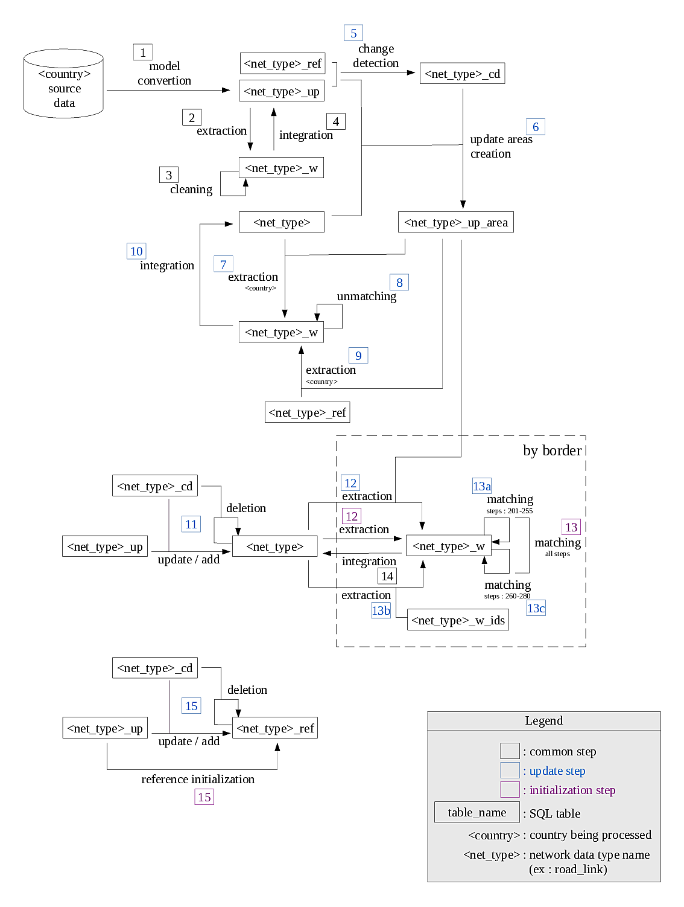

# Description du processus pour l'intégration de nouvelles données de type réseau

# Introduction

Ce document a pour objectif de décrire de manière macroscopique le processus d'intégration des données d'un pays dans la base de données OME2 que ce soit pour une initialisation (première intégration) ou une mise à jour.

Le processus d'écrit ici est spécifique aux données de type réseau qui sont constituées d'objets de type géométrique linéaire formant une structure topologique cohérente.
Dans le cadre du projet OME2 les jeux de données répondant à cette définition sont les suivants:
- le réseau routier : table _road_link_ du thème transport (tn)
- le réseau ferré : table _railway_link_ du thème transport (tn)
- le réseau hydrographique : table _watercourse_link_ du thème hydrographie (hy)

# Description du processus

Le schéma ci-après détail le processus complet d'intégration des données d'un pays dans la base OME2.
Quel que soit le format de livraison adopté par le producteur de données, celles-ci sont injectées dans une base de données PostGIS. C'est cette base de données qui constitue la donnée source du processus.



## Déroulement du processus

Pour décrire le déroulement du processus on se place dans le cas de l'intégration des données de la classe *<net_type>* du pays *<ome2land>* dont le code pays est **om**.
La classe de données *<net_type>* appartient au thème *<theme>* qui à pour code **th**.
Le pays *<ome2land>* possède un voisin *<ome2neighbor>* dont le code pays est **nb**.


### Etape 1 : conversion de modèle

Cette étape consiste à convertir les données depuis leur modèle national d'origine vers le modèle OME2.
Dans le cas d'une première intégration des donnés du pays *<ome2land>*, l'opérateur chargé de la réalisation de cette étape devra écrire l'ensemble des fichiers de configuration décrivant les opérations de conversion pour chaque champ.
Dans le cas d'une mise à jour l'opérateur devra s'assurer que le modèle national n'a pas évolué depuis la dernière intégration. Si le modèle a subi des modifications, les fichiers de configuration devront être adaptés en conséquence.
Les fichiers de configuration constituent le coeur du moteur de conversion.
La table cible est la table de mise à jour *<net_type>_up*.
Préalablement à la conversion des données, si la table *<net_type>_up* n'existe pas elle est créée, sinon tous les objets du pays *<ome2land>* (avec le code 'om') sont supprimés.


#### outil utilisé

[data-model-transformer](https://github.com/openmapsforeurope2/data-model-transformer)

#### configuration
Le fichier de configuration conf.json doit être renseigné en indiquant les paramètres de connexion aux bases source et cible, ainsi que les codes du pays et du thème traités.
Le fichier se présente sous la forme suivante:
```
{
    "country":"om",
    "theme":"th",
    "output":"",
    "source_db":{
        "host":"",
        "port":"",
        "name":"",
        "user":"",
        "pwd":"",
        "schema": ""
    },
    "target_db":{
        "host":"",
        "port":"",
        "name":"",
        "user":"",
        "pwd":"",
        "schema": ""
    }
}
```

#### commande
```
python3 transform.py -c conf.json
```

### Etapes 2, 3 et 4 : nettoyage de données

On procéde ici au nettoyage des données dans la table de mise à jour.
Cela consiste à supprimer les objets situés à l'extérieur de leur pays et dont la distance à la frontière dépasse un certain seuil.

Cette phase du processus se déroule en trois étapes :
- étape 2) extraction dans la table de travail *<net_type>_w* des données situées autour de toutes les frontières du pays *<ome2land>*
- étape 3) nettoyage des données dans la table de travail.
- étape 4) intégration des modifications dans la table de mise à jour *<net_type>_up*

#### outil utilisé

[data-tools](https://github.com/openmapsforeurope2/data-tools)

#### configuration

Dans le fichier db_conf.json doivent être renseignés les paramètres de connexion à la base de donnée OME2.
<br>
Dans le fichier conf.json il faut veiller à ce que les différents schémas soient en cohérence avec la structure de la base OME2.
Voici, par exemple, à quoi peut ressembler la configuration des schémas pour le thème <theme>
```
{
    ...
    "data": {
        ...
        "themes": {
            "th": {
                "schema": "prod",
                "h_schema": "prod",
                "w_schema": "work",
                "u_schema": "work",
                "r_schema": "ref",
                "tables": [
                    "road_link",
                    ...
```

#### commandes

Voici l'enchainement des trois commandes qui constituent la phase de nettoyage:

- étape 2)
```
python3 border_extract.py -c conf.json -T th -t <net_type> -d 4000 om '#'
```
- étape 3)
```
python3 clean.py -c conf.json -d 5 -T th -t <net_type> om
```
- étape 4)
```
python3 integrate.py -c conf.json -T th -t <net_type> -s 10
```

### Etape 5 : détection de changements

Cette étape, à lancer dans le cas d'une mise à jour, permet de calculer les différences sémantiques et géométriques entre deux versions d'un même jeu de données.
Les deux tables à comparer sont :
- *<net_type>_ref* : la table de référence dans laquelle est stockée la dernière version du jeux de données qui a été intégré.
- *<net_type>_up* : la table de mise à jour contenant la nouvelle version du jeux de données que l'on souhaite intégrer.

Toutes les différences (suppressions, ajouts et modifications) sont enregistrées dans la table *<net_type>_cd*.
Préalablement au calcul du différentiel, si la table *<net_type>_cd* n'existe pas, elle est créée, sinon tous les enregistrements du pays *<ome2land>* (avec le code 'om') sont supprimés.

Parmi les informations contenue dans la table résultat, on trouve:
- l'identifiant dans la table de référence
- l'identifiant dans la table de mise à jour
- un indicateur mentionnant si la différence est de nature géométrique
- un indicateur mentionnant si la différence est de nature sémantique
- un indicateur mentionnant si la différence est de nature sémantique et impactante pour le processus de raccordement aux frontières à venir

#### outil utilisé

[change_detection](https://github.com/openmapsforeurope2/change_detection)

#### configuration

Dans le fichier db_conf.ini doivent être renseignés les paramètres de connexion à la base de donnée OME2.
<br>
Dans le fichier theme_parameters.ini, on a parmi les paramètres de configuration notables :
- un seuil de détection d'une modification géométrique
- la taille des dalles (le calcul de détection de changements est réalisé selon une tesselation)
- la liste des champs à ignorer pour la détection de changements sémantiques
- la liste des champs impactants le processus de raccordement aux frontières

#### commande
```
change_detection --c epg_parameters.ini --op diff --T th --f <net_type> --cc om
```

### Etapes 6 : création des zones de mise à jour

Les zones de mise à jour sont créés dans la table *<net_type>_up_area* par concaténation de buffers réalisés autour des objets proches de la frontière ajoutés, supprimés ou ayant subi une modification géométrique ou une modification sémantique impactant le processus de raccordement.
Préalablement à la création des zones de mise à jour, si la table *<net_type>_up_area* n'existe pas elle est créée, sinon tous les objets du pays *<ome2land>* (avec le code 'om') sont supprimés.


#### outil utilisé

[up_area_tools](https://github.com/openmapsforeurope2/up_area_tools)


#### configuration

Dans le fichier db_conf.ini doivent être renseignés les paramètres de connexion à la base de donnée OME2.
<br>
Le fichier theme_parameters.ini, permet de réaliser les paramétrages suivants :
- distance seuil permettant de sélectionner les objets proches de la frontière
- rayon du buffer réalisé autour d'un objet mis à jour

#### commande
```
up_area_tools --c epg_parameters.ini --op create --T th --f <net_type> --cc om
```

### Etapes 7, 8, 9, 10 et 11 : substitution des objets dans les zones de mise à jour

Dans le contexte d'une mise à jour, l'objectif est ici de supprimer, dans les zones de mise à jour, les données du pays *<ome2land>* qui ont été précédemment raccordées, puis d'injecter dans ces mêmes zones les données issues du nouveau jeu de données.

Cette phase du processus se déroule en cinq étapes :
- étape 7) extraction depuis la table de production dans la table de travail *<net_type>_w* des données du pays *<ome2land>* situées dans les zones de mise à jour.
- étape 8) suppression dans les zones de mise à jour des objets et des informations attributaires du pays *<ome2land>*
- étape 9) extraction depuis la table de référence (jeu de données antérieur avant raccordement) dans la table de travail *<net_type>_w* des données du pays *<ome2land>* situées dans les zones de mise à jour.
- étape 10) intégration des modifications dans la table de production (suppression des données raccordées et injection des données de référence dans les zones de mise à jour)
- étape 11) application du différentiel sur la table de production afin de substituer, dans les zone de mise à jour, les données de mise à jour aux données de référence.

#### outils utilisés

[up_area_tools](https://github.com/openmapsforeurope2/up_area_tools)
<br>
[unmatching](https://github.com/openmapsforeurope2/unmatching)
<br>
[data-tools](https://github.com/openmapsforeurope2/data-tools)
<br>
[change_detection](https://github.com/openmapsforeurope2/change_detection)

#### configuration

Pour l'outil *data-tools*, dans le fichier db_conf.json doivent être renseignés les paramètres de connexion à la base de donnée OME2. Pour les autres outils il s'agit du fichier db_conf.ini.
<br>
Autres éléments de configuration notables :
- dans le fichier theme_parameters.ini de l'outil *up_area_tools*, il est possible de définir la taille des dalles utilisées pour l'extraction afin d'optimiser la gestion de la mémoire.
- dans le fichier theme_parameters.ini de l'outil *unmatching*, il faut spécifier les champs qui ne sont pas concaténés lors d'une fusion réalisée au cours du processus de raccordement.

#### commandes

Voici l'enchainement des cinq commandes qui constituent cette phase du processus :

- étape 7)
```
up_area_tools --c epg_parameters.ini --op extract --T th --f <net_type> --cc om
```
- étape 8)
```
unmatching --c epg_parameters.ini --cc om
```
- étape 9)
```
up_area_tools --c epg_parameters.ini --op extract --from_up --without_ids --T th --f <net_type> --cc om
```
- étape 10)
```
python3 integrate.py -c conf.json -T th -t <net_type> -s 10
```
- étape 11)
```
change_detection --c epg_parameters.ini -- op apply_diff --T th --f <net_type> --ref prod --cc om
```


### Etapes 12, 13, 14 : processus de raccordement des objets frontaliers

Le processus de raccordement est lancé itérativement, frontière par frontière (une frontière est composée de l'ensemble des géométries linéaires constituant la séparation entre deux pays frontaliers). On va donc traiter successivement les frontières du pays *<ome2land>* le séparant de l'ensemble de ses pays voisins.

Le traitement est réalisé en trois étapes:
- étape 12) extraction des données autour de la frontière à traiter depuis la table de production
- étape 13) raccordement transfrontalier
- étape 14) intégration des modifications dans le table de production

Le processus de mise à jour différe du processus de constitution initiale. En effet, dans le cas d'une mise à jour, on ne va extraire à l'étape 12) que les données situées dans les zones de mise à jour. Ensuite l'étape 13) sera séquencée en trois sous-étape : on lance la première partie du processus de raccordement sur les données situées dans les zones de mise à jour, ensuite on extrait de la table de production le reste des données frontalières pour enfin lancer la seconde partie du processus de raccordement (cette deuxième phase réalise des nettoyages basés sur des calculs de chemins qui nécessitent d'avoir l'ensemble du réseau).
<br>
[data-tools](https://github.com/openmapsforeurope2/data-tools)
<br>
[net_matching](https://github.com/openmapsforeurope2/net_matching)

#### configuration

Pour l'outil *data-tools*, dans le fichier db_conf.json doivent être renseignés les paramètres de connexion à la base de donnée OME2. Pour les autres outils il s'agit du fichier db_conf.ini.
<br>
l'outil *up_area_tools* possède un fichier de configuration theme_parameters.ini dans lequel il est possible de définir la taille des dalles utilisées pour l'extraction à des fins d'optimisation de l'utilisation de la mémoire.
<br>
L'outil *net_matching* possède un fichier de configuration par type de réseau (road_link, railway, watercourse_link). Chacun de ces fichiers possède de nombreux paramètres permettant de configurer les algorithmes de raccordement. Ces paramètres peuvent être ajustés en fonction des spécificités de chaque pays.

#### commandes

Voici l'ensemble des commandes à lancer dans le cas d'une initialisation :

- étape 12)
```
python3 border_extract.py -c conf.json -T th -t <net_type> -d 1000 om nb
```
- étape 13)
```
tn_matching --c epg_parameters.ini --T th --cc nb#om
```
- étape 14)
```
python3 integrate.py -c conf.json -T th -t <net_type> -s 20
```


Lors d'une mise à jour, les commandes à lancer seront les suivantes :

- étape 12)
```
up_area_tools --c epg_parameters.ini --op extract --T th --f <net_type> --cc om --ncc nb
```
- étape 13)
    - a)
    ```
    tn_matching --c epg_parameters.ini --T th --cc nb#om --sp 201-255
    ```
    - b)
    ```
    python3 border_extract.py -c conf.json -T th -t <net_type> -d 1000 om nb
    ```
    - c)
    ```
    tn_matching --c epg_parameters.ini --T th --cc nb#om --sp 260-280
    ```

- étape 14)
```
python3 integrate.py -c conf.json -T tn -t <net_type> -s 20
```


### Etape 15 : mise à jour de la table de référence

Dans le contexte d'une mise à jour, à l'issu du processus, il faut appliquer le différentiel sur la table de référence afin quelle reflète l'état initial des dernières données injectées du pays traité. Ainsi cette table pourra servir de base pour le calcul du différentiel lors de la prochaine mise à jour.
<br>
Dans le contexte d'une constitution initiale, les données de la table de mise à jour sont simplement copiées dans la table de référence.

#### outils utilisés

[change_detection](https://github.com/openmapsforeurope2/change_detection)

#### configuration

Dans le fichier db_conf.ini doivent être renseignés les paramètres de connexion à la base de donnée OME2.

#### commandes

```
change_detection --c epg_parameters.ini -- op apply_diff --T th --f <net_type> --ref ref --cc om
```